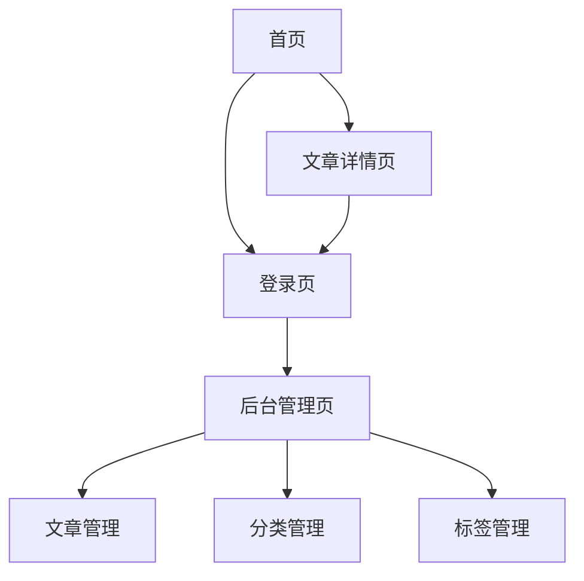

## 1. 产品概述
个人博客网站是一个前后端分离的内容管理系统，支持用户注册登录、文章发布、分类管理、评论互动等功能。采用简洁清爽的设计风格，适合个人技术博客或生活记录博客使用。

目标用户：个人博主、技术爱好者、内容创作者。核心价值：提供简单易用的博客发布平台，支持Markdown格式编辑，具备良好的阅读体验和管理后台。

## 2. 核心功能

### 2.1 用户角色
| 角色 | 注册方式 | 核心权限 |
|------|----------|----------|
| 普通用户 | 邮箱注册 | 浏览文章、发表评论、个人信息管理 |
| 管理员 | 后台设置 | 文章管理、分类标签管理、评论管理、用户管理 |

### 2.2 功能模块
本博客系统包含以下核心页面：
1. **首页**：文章列表展示、分类筛选、标签筛选、搜索功能
2. **文章详情页**：文章内容展示、评论发布、评论列表
3. **登录页**：用户登录、注册功能
4. **后台管理页**：文章管理、分类管理、标签管理

### 2.3 页面详情
| 页面名称 | 模块名称 | 功能描述 |
|----------|----------|----------|
| 首页 | 文章列表 | 展示所有已发布文章，支持分页显示，每页10篇文章 |
| 首页 | 分类筛选 | 按文章分类进行筛选，支持多选 |
| 首页 | 标签筛选 | 按文章标签进行筛选，支持多选 |
| 首页 | 搜索功能 | 根据文章标题进行模糊搜索 |
| 文章详情页 | 文章内容 | 展示文章标题、作者、发布时间、分类、标签、正文内容 |
| 文章详情页 | 评论发布 | 登录用户可发表评论，支持Markdown格式 |
| 文章详情页 | 评论列表 | 展示该文章的所有评论，按时间倒序排列 |
| 登录页 | 用户登录 | 输入用户名和密码进行登录，支持JWT认证 |
| 登录页 | 用户注册 | 新用户注册，填写用户名、邮箱、密码 |
| 后台管理页 | 文章管理 | 新增文章、编辑文章、删除文章、文章发布状态管理 |
| 后台管理页 | 分类管理 | 添加分类、编辑分类、删除分类 |
| 后台管理页 | 标签管理 | 添加标签、编辑标签、删除标签 |

## 3. 核心流程

### 普通用户流程
1. 访问首页浏览文章列表
2. 点击文章标题进入详情页阅读
3. 登录后可发表评论
4. 可通过分类、标签、搜索筛选文章

### 管理员流程
1. 登录系统进入后台管理
2. 在后台管理页面进行文章发布、编辑、删除
3. 管理文章分类和标签
4. 管理用户评论

## 4. 用户界面设计

### 4.1 设计风格
- **主色调**：深蓝色 (#2c3e50) + 白色背景
- **辅助色**：浅灰色 (#ecf0f1)、橙色 (#e67e22)用于强调
- **按钮样式**：圆角矩形，hover效果
- **字体**：系统默认字体，标题18px，正文14px
- **布局风格**：顶部导航栏 + 主内容区域 + 侧边栏
- **图标风格**：使用Font Awesome图标库

### 4.2 页面设计概述
| 页面名称 | 模块名称 | UI元素 |
|----------|----------|----------|
| 首页 | 导航栏 | 网站logo、首页链接、分类下拉菜单、登录/用户名显示 |
| 首页 | 文章列表 | 卡片式布局，显示文章标题、摘要、作者、发布时间、分类、标签 |
| 首页 | 侧边栏 | 分类列表、标签云、搜索框、最新文章 |
| 文章详情页 | 文章头部 | 文章标题、作者、发布时间、分类、标签 |
| 文章详情页 | 文章内容 | Markdown渲染后的HTML内容，代码高亮 |
| 文章详情页 | 评论区 | 评论输入框、发表评论按钮、评论列表 |
| 登录页 | 登录表单 | 用户名输入框、密码输入框、登录按钮、注册链接 |
| 后台管理页 | 管理导航 | 文章管理、分类管理、标签管理、退出登录 |
| 后台管理页 | 文章列表 | 表格形式展示，包含编辑、删除、发布状态切换按钮 |

### 4.3 响应式设计
采用桌面端优先设计，适配移动端显示。在移动设备上：
- 导航栏变为汉堡菜单
- 侧边栏移至底部或隐藏
- 文章列表变为单列布局
- 字体大小适当调整