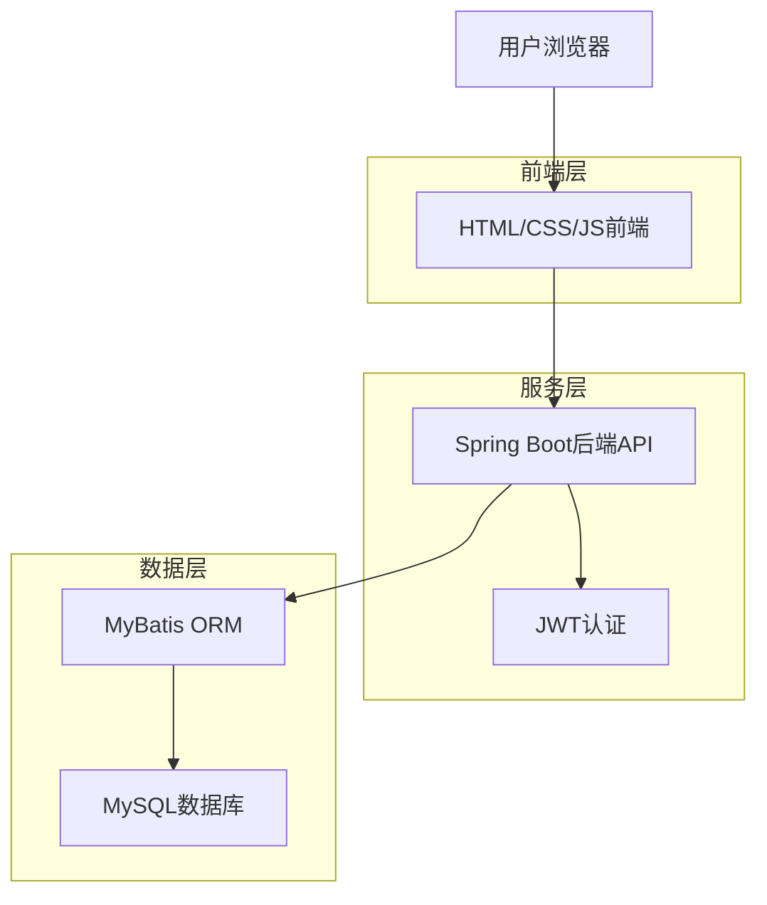
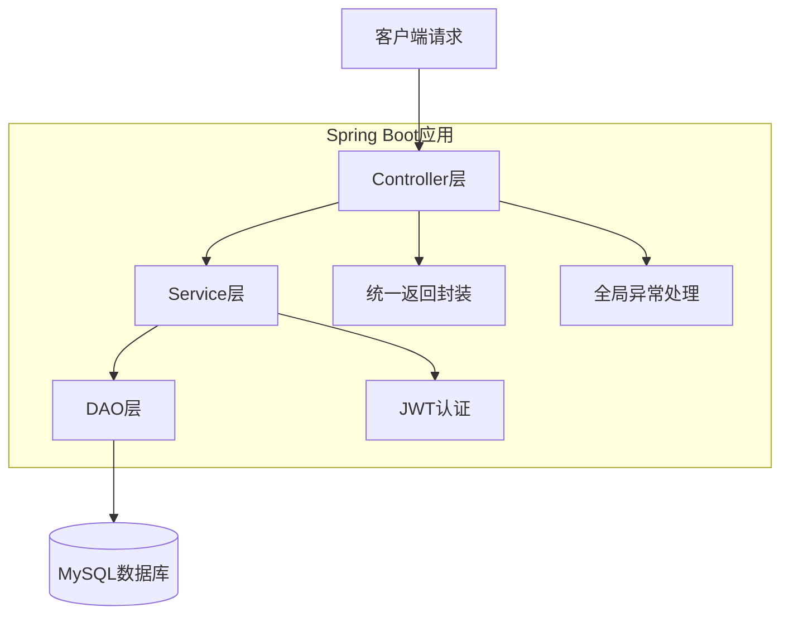
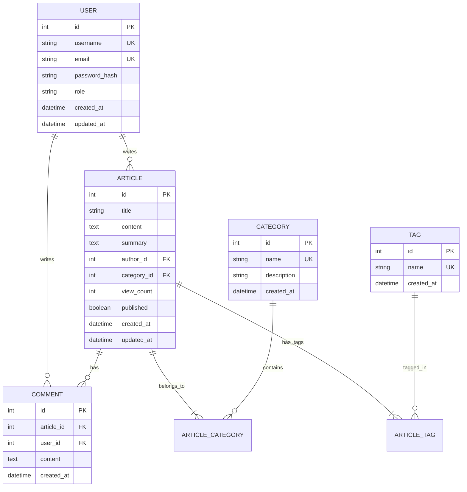

## 1. 架构设计



## 2. 技术描述

* **后端**: JDK 1.8 + Spring Boot 2.7.x + MyBatis 3.5.x

* **数据库**: MySQL 8.x

* **前端**: HTML5 + CSS3 + JavaScript (ES6+)

* **构建工具**: Maven 3.8+

* **其他依赖**:

  * JWT (jjwt 0.9.1)

  * MySQL Connector (8.0.x)

  * Jackson (2.13.x)

  * Commons Lang3 (3.12.x)

## 3. 路由定义

| 路由                 | 用途        |
| ------------------ | --------- |
| /                  | 首页，文章列表展示 |
| /article/{id}      | 文章详情页     |
| /login             | 用户登录页面    |
| /admin             | 后台管理页面    |
| /api/auth/login    | 用户登录API   |
| /api/auth/register | 用户注册API   |
| /api/articles      | 文章列表API   |
| /api/articles/{id} | 单篇文章API   |
| /api/categories    | 分类管理API   |
| /api/tags          | 标签管理API   |
| /api/comments      | 评论管理API   |

## 4. API定义

### 4.1 认证相关API

**用户登录**

```
POST /api/auth/login
```

请求参数：

| 参数名      | 参数类型   | 是否必需 | 描述     |
| -------- | ------ | ---- | ------ |
| username | string | 是    | 用户名    |
| password | string | 是    | 密码（明文） |

响应参数：

| 参数名        | 参数类型   | 描述           |
| ---------- | ------ | ------------ |
| code       | int    | 响应状态码（200成功） |
| message    | string | 响应消息         |
| data       | object | 返回数据         |
| data.token | string | JWT令牌        |
| data.user  | object | 用户信息         |

示例：

```json
{
  "username": "admin",
  "password": "123456"
}
```

响应示例：

```json
{
  "code": 200,
  "message": "登录成功",
  "data": {
    "token": "eyJhbGciOiJIUzI1NiJ9...",
    "user": {
      "id": 1,
      "username": "admin",
      "role": "ADMIN"
    }
  }
}
```

**用户注册**

```
POST /api/auth/register
```

请求参数：

| 参数名      | 参数类型   | 是否必需 | 描述   |
| -------- | ------ | ---- | ---- |
| username | string | 是    | 用户名  |
| email    | string | 是    | 邮箱地址 |
| password | string | 是    | 密码   |

### 4.2 文章相关API

**获取文章列表**

```
GET /api/articles?page=1&size=10&category=1&tag=2
```

响应参数：

| 参数名        | 参数类型   | 描述    |
| ---------- | ------ | ----- |
| code       | int    | 响应状态码 |
| data       | object | 分页数据  |
| data.list  | array  | 文章列表  |
| data.total | int    | 总记录数  |
| data.pages | int    | 总页数   |

**创建文章**

```
POST /api/articles
```

请求头：

```
Authorization: Bearer {jwt_token}
```

请求参数：

| 参数名        | 参数类型   | 是否必需 | 描述             |
| ---------- | ------ | ---- | -------------- |
| title      | string | 是    | 文章标题           |
| content    | string | 是    | 文章内容（Markdown） |
| categoryId | int    | 是    | 分类ID           |
| tagIds     | array  | 否    | 标签ID数组         |
| summary    | string | 否    | 文章摘要           |

## 5. 服务器架构图



## 6. 数据模型

### 6.1 数据模型定义



### 6.2 数据定义语言

**用户表 (users)**

```sql
CREATE TABLE users (
    id INT PRIMARY KEY AUTO_INCREMENT,
    username VARCHAR(50) NOT NULL UNIQUE,
    email VARCHAR(100) NOT NULL UNIQUE,
    password_hash VARCHAR(255) NOT NULL,
    role ENUM('USER', 'ADMIN') DEFAULT 'USER',
    created_at TIMESTAMP DEFAULT CURRENT_TIMESTAMP,
    updated_at TIMESTAMP DEFAULT CURRENT_TIMESTAMP ON UPDATE CURRENT_TIMESTAMP,
    INDEX idx_username (username),
    INDEX idx_email (email)
);

-- 初始化管理员用户
INSERT INTO users (username, email, password_hash, role) 
VALUES ('admin', 'admin@blog.com', '$2a$10$N.zmdr9k7uOCQb376NoUnuTJ8i at the end, 'ADMIN');
```

**文章表 (articles)**

```sql
CREATE TABLE articles (
    id INT PRIMARY KEY AUTO_INCREMENT,
    title VARCHAR(200) NOT NULL,
    content TEXT NOT NULL,
    summary TEXT,
    author_id INT NOT NULL,
    category_id INT NOT NULL,
    view_count INT DEFAULT 0,
    published BOOLEAN DEFAULT FALSE,
    created_at TIMESTAMP DEFAULT CURRENT_TIMESTAMP,
    updated_at TIMESTAMP DEFAULT CURRENT_TIMESTAMP ON UPDATE CURRENT_TIMESTAMP,
    INDEX idx_author (author_id),
    INDEX idx_category (category_id),
    INDEX idx_created_at (created_at DESC),
    FOREIGN KEY (author_id) REFERENCES users(id) ON DELETE CASCADE,
    FOREIGN KEY (category_id) REFERENCES categories(id) ON DELETE RESTRICT
);
```

**分类表 (categories)**

```sql
CREATE TABLE categories (
    id INT PRIMARY KEY AUTO_INCREMENT,
    name VARCHAR(50) NOT NULL UNIQUE,
    description VARCHAR(200),
    created_at TIMESTAMP DEFAULT CURRENT_TIMESTAMP,
    INDEX idx_name (name)
);

-- 初始化分类数据
INSERT INTO categories (name, description) VALUES 
('技术分享', '技术相关文章'),
('生活随笔', '生活感悟和随笔'),
('学习笔记', '学习过程中的笔记');
```

**标签表 (tags)**

```sql
CREATE TABLE tags (
    id INT PRIMARY KEY AUTO_INCREMENT,
    name VARCHAR(30) NOT NULL UNIQUE,
    created_at TIMESTAMP DEFAULT CURRENT_TIMESTAMP,
    INDEX idx_name (name)
);
```

**评论表 (comments)**

```sql
CREATE TABLE comments (
    id INT PRIMARY KEY AUTO_INCREMENT,
    article_id INT NOT NULL,
    user_id INT NOT NULL,
    content TEXT NOT NULL,
    created_at TIMESTAMP DEFAULT CURRENT_TIMESTAMP,
    INDEX idx_article (article_id),
    INDEX idx_user (user_id),
    INDEX idx_created_at (created_at DESC),
    FOREIGN KEY (article_id) REFERENCES articles(id) ON DELETE CASCADE,
    FOREIGN KEY (user_id) REFERENCES users(id) ON DELETE CASCADE
);
```

**文章标签关联表 (article\_tags)**

```sql
CREATE TABLE article_tags (
    id INT PRIMARY KEY AUTO_INCREMENT,
    article_id INT NOT NULL,
    tag_id INT NOT NULL,
    created_at TIMESTAMP DEFAULT CURRENT_TIMESTAMP,
    UNIQUE KEY uk_article_tag (article_id, tag_id),
    INDEX idx_tag (tag_id),
    FOREIGN KEY (article_id) REFERENCES articles(id) ON DELETE CASCADE,
    FOREIGN KEY (tag_id) REFERENCES tags(id) ON DELETE CASCADE
);
```

## 7. 项目目录结构

```
personal-blog/
├── backend/                          # Spring Boot后端项目
│   ├── src/main/java/com/blog/
│   │   ├── config/                  # 配置类
│   │   │   ├── SecurityConfig.java  # 安全配置
│   │   │   └── JwtConfig.java       # JWT配置
│   │   ├── controller/              # 控制器层
│   │   │   ├── AuthController.java  # 认证控制器
│   │   │   ├── ArticleController.java
│   │   │   ├── CategoryController.java
│   │   │   ├── TagController.java
│   │   │   └── CommentController.java
│   │   ├── service/                 # 服务层
│   │   │   ├── impl/               # 服务实现类
│   │   │   └── interfaces/         # 服务接口
│   │   ├── dao/                     # 数据访问层
│   │   │   └── mapper/             # MyBatis映射器
│   │   ├── entity/                  # 实体类
│   │   ├── dto/                     # 数据传输对象
│   │   ├── exception/               # 异常处理
│   │   └── utils/                   # 工具类
│   ├── src/main/resources/
│   │   ├── mapper/                  # MyBatis XML映射文件
│   │   ├── application.yml          # 应用配置
│   │   └── application-dev.yml      # 开发环境配置
│   └── pom.xml                      # Maven依赖配置
│
├── frontend/                         # 前端项目
│   ├── css/
│   │   ├── style.css                # 主样式文件
│   │   └── admin.css                # 后台管理样式
│   ├── js/
│   │   ├── api.js                   # API调用封装
│   │   ├── auth.js                  # 认证相关JS
│   │   ├── utils.js                 # 工具函数
│   │   └── main.js                  # 主JS文件
│   ├── pages/
│   │   ├── index.html               # 首页
│   │   ├── article.html             # 文章详情页
│   │   ├── login.html               # 登录页
│   │   └── admin.html               # 后台管理页
│   └── lib/                         # 第三方库
│       ├── marked.min.js            # Markdown解析器
│       └── highlight.min.js         # 代码高亮
│
└── docs/                            # 项目文档
    ├── README.md                    # 项目说明
    └── SQL/                         # 数据库脚本
        └── init.sql                 # 数据库初始化脚本
```

## 8. 启动步骤

### 8.1 数据库初始化

```bash
# 登录MySQL
mysql -u root -p

# 创建数据库
CREATE DATABASE blog_db CHARACTER SET utf8mb4 COLLATE utf8mb4_unicode_ci;

# 使用数据库
USE blog_db;

# 执行初始化SQL脚本
source docs/SQL/init.sql;
```

### 8.2 后端启动

```bash
# 进入后端目录
cd backend

# 安装Maven依赖
mvn clean install

# 修改配置文件
# 编辑 src/main/resources/application.yml
# 配置数据库连接信息

# 启动应用
mvn spring-boot:run
# 或
java -jar target/blog-backend.jar
```

### 8.3 前端启动

```bash
# 进入前端目录
cd frontend

# 使用Live Server或其他HTTP服务器
# VS Code插件Live Server
# 或直接打开index.html（需要解决跨域问题）

# 配置API地址
# 编辑 js/api.js 中的API_BASE_URL
```

### 8.4 跨域配置

在Spring Boot中添加跨域配置：

```java
@Configuration
public class CorsConfig {
    @Bean
    public WebMvcConfigurer corsConfigurer() {
        return new WebMvcConfigurer() {
            @Override
            public void addCorsMappings(CorsRegistry registry) {
                registry.addMapping("/api/**")
                    .allowedOrigins("*")
                    .allowedMethods("GET", "POST", "PUT", "DELETE")
                    .allowedHeaders("*")
                    .exposedHeaders("Authorization");
            }
        };
    }
}
```

## 9. 关键代码示例

### 9.1 统一返回结果封装

```java
@Data
public class Result<T> {
    private int code;
    private String message;
    private T data;
    
    public static <T> Result<T> success(T data) {
        Result<T> result = new Result<>();
        result.setCode(200);
        result.setMessage("操作成功");
        result.setData(data);
        return result;
    }
    
    public static <T> Result<T> error(String message) {
        Result<T> result = new Result<>();
        result.setCode(500);
        result.setMessage(message);
        return result;
    }
}
```

### 9.2 JWT工具类

```java
@Component
public class JwtUtils {
    @Value("${jwt.secret}")
    private String secret;
    
    @Value("${jwt.expiration}")
    private Long expiration;
    
    public String generateToken(String username) {
        Date expirationDate = new Date(System.currentTimeMillis() + expiration);
        return Jwts.builder()
                .setSubject(username)
                .setIssuedAt(new Date())
                .setExpiration(expirationDate)
                .signWith(SignatureAlgorithm.HS512, secret)
                .compact();
    }
    
    public String getUsernameFromToken(String token) {
        return Jwts.parser()
                .setSigningKey(secret)
                .parseClaimsJws(token)
                .getBody()
                .getSubject();
    }
    
    public boolean validateToken(String token) {
        try {
            Jwts.parser().setSigningKey(secret).parseClaimsJws(token);
            return true;
        } catch (Exception e) {
            return false;
        }
    }
}
```

### 9.3 前端API调用封装

```javascript
// api.js
const API_BASE_URL = 'http://localhost:8080/api';

class ApiClient {
    constructor() {
        this.token = localStorage.getItem('token');
    }
    
    async request(url, options = {}) {
        const headers = {
            'Content-Type': 'application/json',
            ...options.headers
        };
        
        if (this.token) {
            headers['Authorization'] = `Bearer ${this.token}`;
        }
        
        const response = await fetch(`${API_BASE_URL}${url}`, {
            ...options,
            headers
        });
        
        if (!response.ok) {
            throw new Error(`HTTP error! status: ${response.status}`);
        }
        
        return await response.json();
    }
    
    async login(username, password) {
        return this.request('/auth/login', {
            method: 'POST',
            body: JSON.stringify({ username, password })
        });
    }
    
    async getArticles(page = 1, size = 10) {
        return this.request(`/articles?page=${page}&size=${size}`);
    }
}

window.apiClient = new ApiClient();
```

